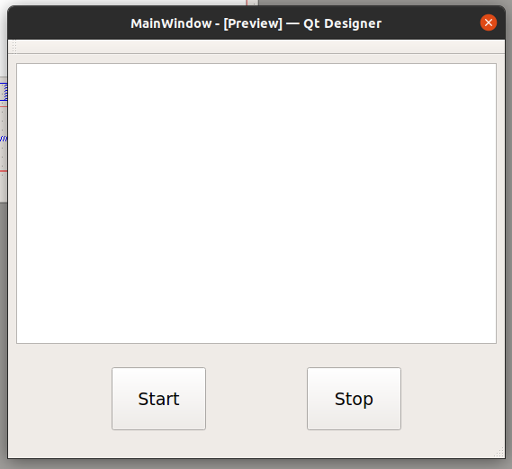

# speech2text-CMUSphinx
CMUSphinx based ASR with Qt C++ User interface. It capture audio stream from microphone and convert the audio stdream to text

You can start listening from your microphone by clicking the start buttton and if you click on stop bution micriphone stop listening

